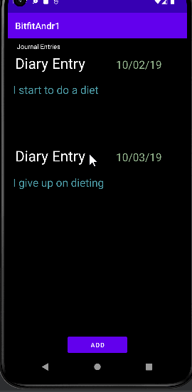

# Android Project 5 - *BitfitDiary*

Submitted by: *Joshua Barrientos*

*BitfitDiary* is a health metrics app that allows users to track what you did in a following day and to see how your lifestyle might be affecting your health 

Time spent: *5* hours spent in total

## Required Features

The following **required** functionality is completed:

- [x] **At least one health metric is tracked (based on user input)**
  - Chosen metric(s): `[Diary Entries]`
- [x] **There is a "create entry" UI that prompts users to make their daily entry**
- [x] **New entries are saved in a database and then updated in the RecyclerView**
- [x] **On application restart, previously entered entries are preserved (i.e., are *persistent*)**
 
The following **optional** features are implemented:

- [ ] **Create a UI for tracking averages and trends in metrics**
- [x] **Improve and customize the user interface through styling and coloring**
- [ ] **Implement orientation responsivity**
- [ ] **Add a daily photo feature**

The following **additional** features are implemented:

- [ ] List anything else that you can get done to improve the app functionality!

## Video Walkthrough

Here's a walkthrough of implemented user stories:

GIF created with [LiceCap](https://www.cockos.com/licecap/) 

## Notes

There was little difficulty. The most difficult was trying to use flow and get all the information from the database into the recycler view.

## License

    Copyright [2022] [Joshua Barrientos]

    Licensed under the Apache License, Version 2.0 (the "License");
    you may not use this file except in compliance with the License.
    You may obtain a copy of the License at

        http://www.apache.org/licenses/LICENSE-2.0

    Unless required by applicable law or agreed to in writing, software
    distributed under the License is distributed on an "AS IS" BASIS,
    WITHOUT WARRANTIES OR CONDITIONS OF ANY KIND, either express or implied.
    See the License for the specific language governing permissions and
    limitations under the License.
